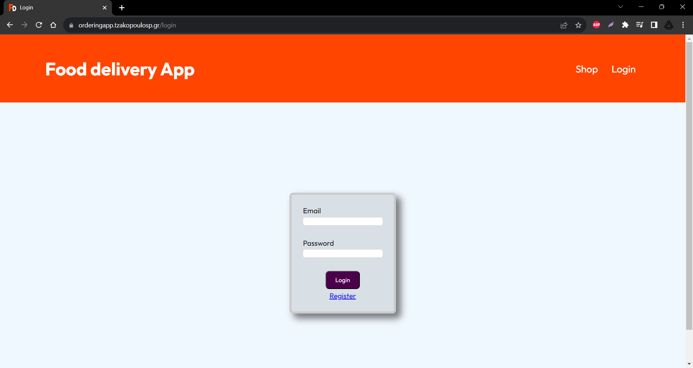

# APP DESCRIPTION

This project is part of the final Assignment at SAE Athens Web Design & Development department.
 
 
Link : http://orderingapp.tzakopoulosp.gr/
 
 
It is a potential food ordering app with the following characteristics and features :
 

- [x] User system
- [x] Login system
- [x] Registration system
- [x] Products system
- [x] Ordering system
- [x] Paying system
       

# Technologies

 

- [x] Node Js (v18.15.0)
- [x] bcryptjs (v2.4.3)
- [x] body-parser (v1.20.2)
- [x] connect-mongodb-session (v3.1.1)
- [x] dotenv (v16.0.3)
- [x] ejs (v3.1.9)
- [x] express (v4.18.2)
- [x] express-session (v1.17.3)
- [x] helmet (v7.0.0)
- [x] mailgun-js (v0.22.0)
- [x] mongoose (v7.0.3)
- [x] nodemailer (v6.9.2)
- [x] nodemon (v2.0.21)
- [x] path (v0.12.7)
- [x] sass (v1.62.1)
- [x] stripe (v12.9.0)
       

# Folder/File structure

:file_folder: Folder
:blue_book: CSS
:closed_book: SCSS
:ledger: JavaScript
:green_book: SCEMAS
:orange_book: EJS
:pencil2: FONTS
:art: IMAGES

 
 

### :file_folder: Controllers  

&nbsp; :ledger: Admin.js  
&nbsp; :ledger: auth.js  
&nbsp; :ledger: error404.js  
&nbsp; :ledger: Shop.js  

### :file_folder: Models  

&nbsp; :green_book: Admin.js  
&nbsp; :green_book: auth.js  
&nbsp; :green_book: error404.js  
&nbsp; :green_book: Shop.js  

### :file_folder: public  

### &nbsp; :file_folder: css  

&nbsp; &nbsp; :blue_book: 404.css  
&nbsp; &nbsp; :blue_book: 404.css.map  
&nbsp; &nbsp; :closed_book: 404.scss  
&nbsp; &nbsp; :blue_book: cart.css  
&nbsp; &nbsp; :blue_book: cart.css.map  
&nbsp; &nbsp; :closed_book: cart.scss  
&nbsp; &nbsp; :blue_book: commingsoon.css  
&nbsp; &nbsp; :blue_book: commingsoon.css.map  
&nbsp; &nbsp; :closed_book: commingsoon.scss  
&nbsp; &nbsp; :blue_book: editProduct.css  
&nbsp; &nbsp; :blue_book: editProduct.css.map  
&nbsp; &nbsp; :closed_book: editProduct.scss  
&nbsp; &nbsp; :blue_book: home.css  
&nbsp; &nbsp; :blue_book: home.css.map  
&nbsp; &nbsp; :closed_book: home.scss  
&nbsp; &nbsp; :blue_book: index.css  
&nbsp; &nbsp; :blue_book: index.css.map  
&nbsp; &nbsp; :closed_book: index.scss  
&nbsp; &nbsp; :blue_book: login.css  
&nbsp; &nbsp; :blue_book: login.css.map  
&nbsp; &nbsp; :closed_book: login.scss  
&nbsp; &nbsp; :blue_book: navigation.css  
&nbsp; &nbsp; :blue_book: navigation.css.map  
&nbsp; &nbsp; :closed_book: navigation.scss  
&nbsp; &nbsp; :blue_book: orders.css  
&nbsp; &nbsp; :blue_book: orders.css.map  
&nbsp; &nbsp; :closed_book: orders.scss  
&nbsp; &nbsp; :blue_book: reviews.css  
&nbsp; &nbsp; :blue_book: reviews.css.map  
&nbsp; &nbsp; :closed_book: reviews.scss  
&nbsp; &nbsp; :blue_book: statistics.css  
&nbsp; &nbsp; :blue_book: statistics.css.map  
&nbsp; &nbsp; :closed_book: statistics.scss  

### &nbsp; :file_folder: fonts  

&nbsp; &nbsp; :pencil2: Outfit-VariableFont_wght.ttf

### &nbsp; :file_folder: images  

&nbsp; &nbsp; :art: 404.jpg  
&nbsp; &nbsp; :art: background.jpg  
&nbsp; &nbsp; :art: favicon.png  
&nbsp; &nbsp; :art: notDelivered.svg  
&nbsp; &nbsp; :art: star.png  

### &nbsp; :file_folder: javascript  

&nbsp; &nbsp; :ledger: addProduct.js  
&nbsp; &nbsp; :ledger: addToCartLoader.js  
&nbsp; &nbsp; :ledger: editProduct.js  
&nbsp; &nbsp; :ledger: filter.js  
&nbsp; &nbsp; :ledger: navBar.js  
&nbsp; &nbsp; :ledger: order.js  
&nbsp; &nbsp; :ledger: postReview.js  
&nbsp; &nbsp; :ledger: statistics.js  

### :file_folder: Routes  

&nbsp; :ledger: Admin.js  
&nbsp; :ledger: Shop.js  

### :file_folder: views  

### &nbsp; :file_folder: admin  

&nbsp; &nbsp; :orange_book: addProduct.ejs  
&nbsp; &nbsp; :orange_book: editProduct.ejs  
&nbsp; &nbsp; :orange_book: statistics.ejs  

### &nbsp; :file_folder: includes  

&nbsp; &nbsp; :orange_book: add-to-cart.ejs  
&nbsp; &nbsp; :orange_book: commingSoon.ejs  
&nbsp; &nbsp; :orange_book: End.ejs  
&nbsp; &nbsp; :orange_book: Head.ejs  
&nbsp; &nbsp; :orange_book: navigation.ejs  
&nbsp; &nbsp; :orange_book: productReviews.ejs  

### &nbsp; :file_folder: user  

&nbsp; &nbsp; :orange_book: cart.ejs  
&nbsp; &nbsp; :orange_book: checkout.ejs  
&nbsp; &nbsp; :orange_book: login.ejs  
&nbsp; &nbsp; :orange_book: orders.ejs  
&nbsp; &nbsp; :orange_book: productCard.ejs  
&nbsp; &nbsp; :orange_book: productFilter.ejs  
&nbsp; &nbsp; :orange_book: register.ejs  
&nbsp; :orange_book: 404.ejs  
&nbsp; :orange_book: index.ejs  
:ledger: App.js  

# Pages Preview

<h1 style="font-size : 80px;"> Home - not logged in </h1>
<progressive-image>

</progressive-image>
 
 
 

<h1 style="font-size : 80px;"> Login </h1>
<progressive-image>

</progressive-image>
 
 
 

<h1 style="font-size : 80px;"> Register </h1>
<progressive-image>

</progressive-image>
 
 
 

<h1 style="font-size : 80px;"> Home - logged in as user </h1>
<progressive-image>

</progressive-image>
 
 
 

<h1 style="font-size : 80px;"> Cart </h1>
<progressive-image>

</progressive-image>
 
 
 

<h1 style="font-size : 80px;"> Orders </h1>
<progressive-image>

</progressive-image>
 
 
 

<h1 style="font-size : 80px;"> Reviews </h1>
<progressive-image>

</progressive-image>
 
 
 

<h1 style="font-size : 80px;"> Home - logged in as admin </h1>
<progressive-image>

</progressive-image>
 
 
 

<h1 style="font-size : 80px;"> Statistics </h1>
<progressive-image>

</progressive-image>
 
 
 
